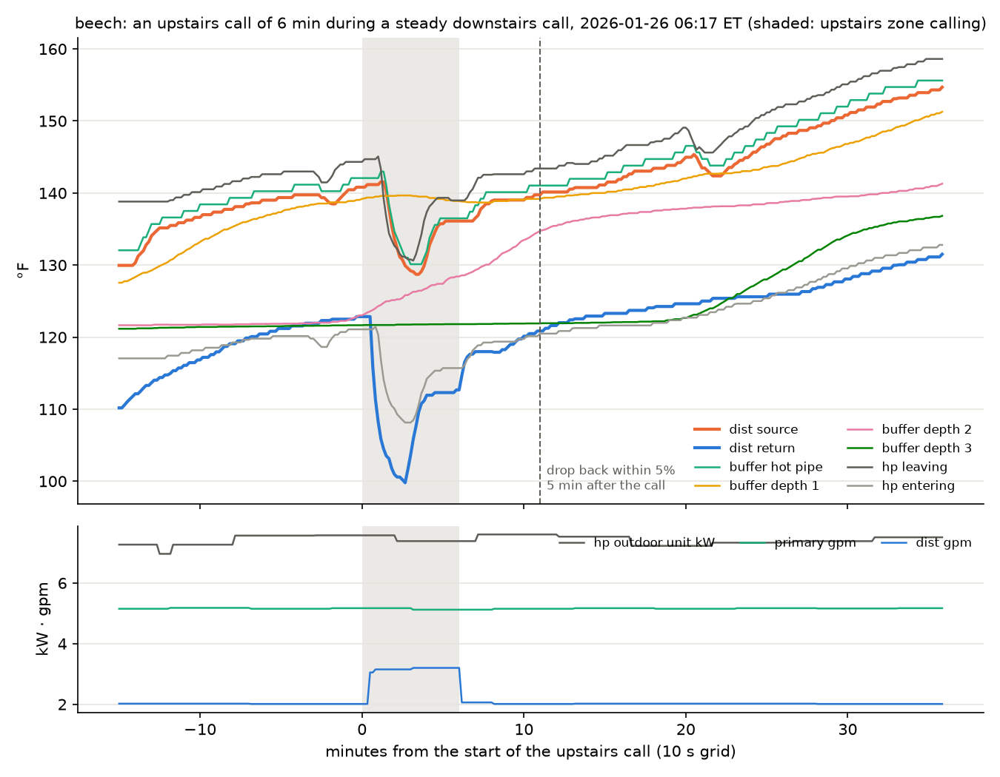

# Cold zone call during steady heating

2026-10-07 · draft

## Summary

**At beech, a cold zone's call leaves no mark on the distribution
temperatures ten minutes after it ends.** Every
call in the 2025-26 season that got back to its pre-call drop did so
within 10 minutes (median 5, nine in ten within 9). Past 10 minutes
the drop moves with the source, not with the slug: its wander is the
same at minutes with no upstairs call for the previous half hour.
Beech's upstairs emitter is a large cast-iron radiator; its loop
comes back as about 4 gallons of room-temperature water (the return
fell 22 °F), so the effect is pronounced there. A house whose idle
zone holds less water needs a shorter window.

A zone whose emitters hold a lot of water and heat calls seldom, and
between calls the water in its loop goes cold. When it does call
while other zones are in steady call, that cold water comes back as
a slug: the return temperature falls by twenty degrees or more within
a minute, and the source-to-return drop is back to its prior value
about five minutes after the call ends. If the heat pump is running,
the slug does not stop at the buffer. It goes from the buffer bottom
through the heat pump and out onto the source about a minute after it
left the zone, so the source dips too. This memo describes the
response at beech, where the upstairs zone is the idle one and the
downstairs zone carries the steady call.

## What happens

1. The idle zone's valve opens. Its loop's cold water is pushed out
   ahead of the hot water now entering it and passes the return
   sensor. At beech the return fell from 122 to 100 °F in two minutes.
2. The cold water enters the buffer at the bottom. With the heat pump
   off it would sit there and warm the heat pump's next start; the
   buffer's depth sensors show it does not disturb the water above.
3. With the heat pump running, the primary loop is drawing from the
   buffer bottom, so the slug goes straight into the heat pump. Its
   entering water fell 13 °F half a minute after the return did.
4. A running heat pump at steady power adds a near-fixed lift, about
   22 °F at beech that morning, so its leaving water fell by the same
   13 °F, and that water went out the buffer hot pipe to the
   distribution source a minute after the slug left the zone.
5. The zone's loop fills with hot water, the return climbs back, and
   the drop is back near its prior value within about five minutes of
   the call ending. The zone's emitters are now warm, so the next call
   from it comes later and the loop is cold again when it does.

While the heat pump runs, the source, the buffer hot pipe and the heat
pump's leaving water sit within a few degrees of one another the
whole time. Distribution is drinking the heat pump's leaving water
almost directly, and the return is the heat pump's entering water
with a half-minute lag.

## Beech, January 26

An upstairs call of six minutes at 06:17 ET during a steady downstairs
call, with the heat pump at 7.5 kW and the primary loop at 5.2 gpm.
Distribution flow went from 2.0 to 3.2 gpm for the call.

The minima, in order:

| Channel | Minimum °F | Time |
|---|---|---|
| distribution return | 100 | 06:19:31 |
| heat pump entering water | 108 | 06:20:00 |
| heat pump leaving water | 131 | 06:20:00 |
| buffer hot pipe | 130 | 06:19:52 |
| distribution source | 129 | 06:20:19 |

Buffer depth 1 held at 139 °F throughout; depths 2 and 3 sat far
below the source and did not react.

## Across the season at beech

The same response in every upstairs call of the 2025-26 season that
fell inside a steady downstairs call with the loop circulating and
fresh readings for ten minutes before and at least ten after: 45
calls, all 6 to 10 minutes long.

- The source-to-return drop widened by a median 18 °F at its peak.
- It was back within 10% of its pre-call value a median 3 minutes
  after the call ended, and within 5% a median 5 minutes after, among
  the calls that got back inside their window. A 5% band on a 19 °F
  drop is ±1 °F, at the sensors' noise.
- **Nothing of the slug remains past that.** Ten to thirty minutes
  after a call the drop sat more than 3 °F from its pre-call value in
  56 to 80% of the calls, and it did the same in 69 to 84% of
  steady-call minutes with no upstairs call in the previous half hour.
  The source itself moves on that timescale (a median 9 to 17 °F over
  those windows) and the drop follows it, 0.23 °F per °F of source at
  beech in steady circulation. With the source's share removed, the
  median residual after a call is within ±2 °F at every horizon from
  10 to 30 minutes, the same as at the control minutes.

## How much water the upstairs loop holds

The return's heat deficit over a call, flow times the drop below the
pre-call return summed minute by minute from the call's start to five
minutes after it ends, is the heat the slug took out. Divided by the
pre-call return less the slug's temperature, it is the slug as a
volume of water at that temperature. The slug is taken to be at
65 °F, room temperature; a mixing check on the January 26 minimum
(3.15 gpm at 100.6 °F against the downstairs 2.0 gpm at 120.6 °F)
gives 65 °F for the water the upstairs loop added.

Across the 45 calls the median is 4.4 gallons, quartiles 3.2 to 6.3;
a slug 5 °F colder or warmer moves the median by 0.3 gallons. The
upstairs valve added a median 0.95 gpm of flow while open. The figure
is a cold-water equivalent: the radiator's iron takes heat from the
water that fills it, and that heat is in the deficit too.

## What it means

- **For the return-temperature question.** While the heat pump runs,
  the water coming back from distribution is the heat pump's entering
  water half a minute later, with nothing in between to soften it.
  A cold slug is a brief gift to the heat pump; a hot return is a
  direct cost.
- **For reading the data.** A window meant to hold one zone's steady
  call should start ten minutes after any call from an idle zone
  ends: five minutes is the measured recovery and ten is the margin.
  A drop that wanders later is following the source, not the slug.
- **For other houses.** The same response is expected wherever a
  seldom-calling zone shares a loop with steady ones, and the size of
  the slug scales with the idle loop's water volume and how cold it
  gets. Only beech has been measured.

## Disclaimers

Where this memo is weakest, for the reader who wants to push on it.

- **The 10-minute window is the maximum of 17 recoveries.** 28 of the
  45 calls never came back inside the 5% band, and the memo attributes
  that to the source's own movement. Measured against the steady line
  instead of the pre-call drop, 21 of those 41 moving-source calls
  recover at a median 5 minutes and 20 do not inside their window; the
  memo does not set its window from that statistic because the line's
  scatter widens the band. The 5% figure is the clean one, and it rests
  on 17 calls.
- **The steady line is a straight fit to 268 hours.** The 0.23 °F per
  °F used to remove the source's share assumes the drop's dependence on
  source is linear and the same at every flow. The detrended residuals
  at control minutes run roughly −3 to +6 °F between quartiles, so
  "median within ±2 °F" is a statement about the centre, not the
  spread.
- **The control minutes are not matched to the calls.** They are every
  fifth eligible minute of the season; the calls fall at particular
  hours and on particular source trajectories. A control matched on
  hour and pre-call source would be stronger and has not been built.
- **The loop volume assumes the slug's temperature.** 65 °F is one
  mixing check on one event. The estimate also folds in the iron's
  heat uptake, so it overstates the water the pipe and radiator hold.
  The source's own dip, a minute after the return's, cools the
  downstairs return a few minutes later and adds a little to the
  deficit.
- **One house.** Every number here is beech's.

## Method notes

Beech's distribution source, return and flow, the heat pump's
entering and leaving water and power, the primary flow, the buffer
hot pipe and depth sensors, and each zone's thermostat white-wire
power, from the journal DB, filled forward onto a 10-second grid. The
season count uses the minute grid of the beech emitter physics mystery
memo (`beech-emitter-physics-mystery.md`) with a reading-age limit of
two minutes. The January 26 minima and the buffer depths come from the
chart's own 10-second pull and are in no table.

Everything here can be re-run from the evidence folder in the
experiments repository:
[`dist-loop-experiments/`](https://github.com/thegridelectric/experiments/tree/main/dist-loop-experiments).
Its [README](https://github.com/thegridelectric/experiments/blob/main/dist-loop-experiments/README.md)
states how the data was obtained and gives the commands that
regenerate every file. The event search, the recovery statistics, the control comparison,
the loop-volume estimate and the chart are
[`bolus_recovery.py`](https://github.com/thegridelectric/experiments/blob/main/dist-loop-experiments/bolus_recovery.py);
its output is
[`beech-bolus-recovery.txt`](https://github.com/thegridelectric/experiments/blob/main/dist-loop-experiments/beech-bolus-recovery.txt),
which runs from the minute file that `pump_speed.py` pulls from the
journal DB (one command, the README gives it). The chart's pull of
the buffer and heat pump temperatures (`--plot`) reaches the journal
DB again. The tables in this memo, one number per cell, are in the
workbook `cold-zone-call-during-steady-heating-memo.xlsx`, which
`sheets.py` in that folder regenerates.
